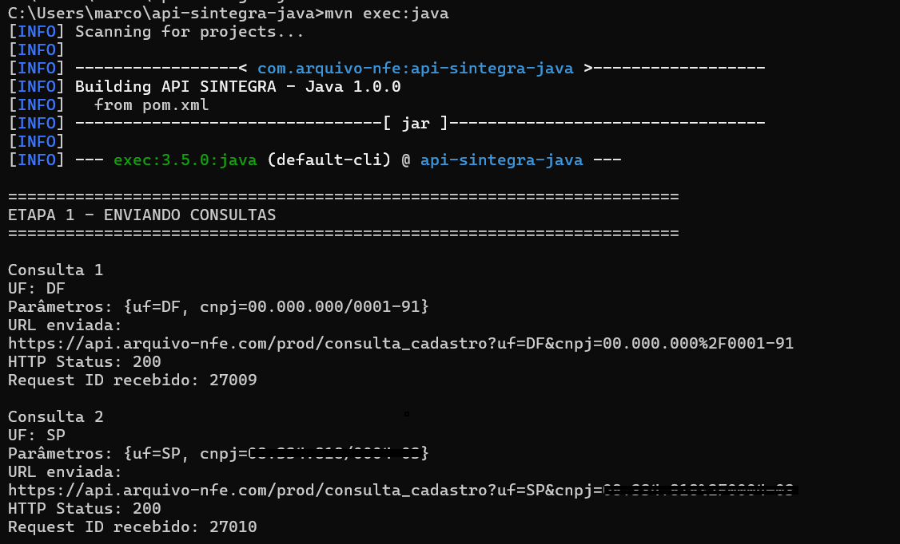
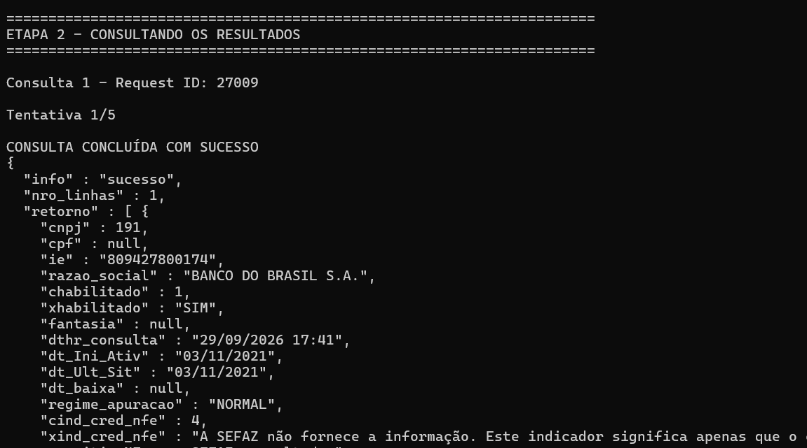
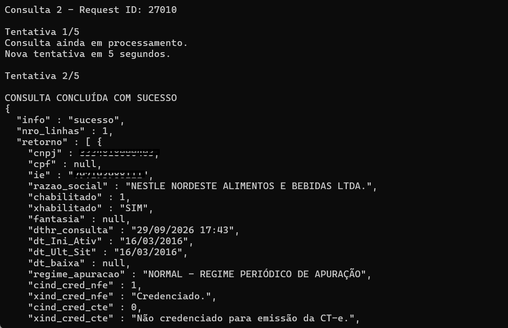

# Integração da API SINTEGRA em Java – Consulta de Inscrição Estadual em tempo real

Exemplo de integração em **Java** com a API SINTEGRA da **ArquivoNFe**, para consulta de dados cadastrais por UF.

A API permite realizar consultas utilizando **CNPJ, CPF ou Inscrição Estadual (IE)**, conforme a disponibilidade da consulta para cada UF.

## 🔎 Palavras-chave

* API SINTEGRA
* Consulta SINTEGRA
* SINTEGRA CCC
* Consulta Inscrição Estadual
* API Fiscal Brasil
* Consulta CNPJ
* Consulta CPF
* Consulta Inscrição Estadual por API
* API REST Java
* Integração Java com API

## Benefícios

✔ Consulta por CNPJ, CPF ou IE
✔ Dados cadastrais retornados pela API
✔ Integração simples via API REST
✔ Processamento assíncrono utilizando `request_id`
✔ Exemplo prático de integração em Java

## Casos de uso

✔ Validação cadastral antes da emissão de NF
✔ Conferência cadastral automática
✔ Verificação de informações de empresas e contribuintes
✔ Integração com sistemas ERP e aplicações próprias
✔ Processos de KYC (Know Your Customer)

## Diferenciais

✔ Consulta dos dados cadastrais disponibilizados pela SEFAZ da UF consultada.
✔ Comunicação segura por HTTPS.
✔ Infraestrutura hospedada na Oracle Cloud no Brasil.
✔ Painel web para configurações, consultas manuais e acompanhamento das integrações via API.
✔ API REST com suporte a consultas por CNPJ, CPF ou Inscrição Estadual.

---

## 🚀 Requisitos

* Windows ou Linux
* Java JDK 11 ou superior
* Apache Maven 3.8 ou superior
* Git (opcional, caso escolha clonar o projeto)

---

## ⚙️ Como utilizar

### 1️⃣ Cadastre-se gratuitamente

Acesse o portal:

https://portal.arquivo-nfe.com

Crie sua conta para obter acesso à API.

---

### 2️⃣ Copie seu Token

Após o login no portal:

1. Acesse o menu **Meu Token**.
2. Copie seu token de acesso.

> ⚠️ **Nunca publique seu token de acesso no GitHub.**

No arquivo `Main.java`, informe seu token apenas localmente:

```java
private static final String TOKEN = "SEU_TOKEN_AQUI";
```

Antes de publicar o código no GitHub, certifique-se de que o token não esteja preenchido.

---

### 3️⃣ Instalação do Java JDK

O exemplo utiliza **Java 11 ou superior**.

#### Windows

Baixe o JDK pelo site oficial:

https://www.oracle.com/java/technologies/downloads/

Após a instalação, abra o **Prompt de Comando (CMD)** e execute:

```bash
java -version
```

Verifique também o compilador:

```bash
javac -version
```

Os comandos deverão apresentar a versão instalada, por exemplo:

```text
java version "11.x"
javac 11.x
```

#### Linux

Verifique se o Java está instalado:

```bash
java -version
```

Caso não esteja instalado, no Ubuntu/Debian utilize:

```bash
sudo apt update
sudo apt install openjdk-11-jdk
```

Depois confirme:

```bash
java -version
javac -version
```

---

### 4️⃣ Instalação do Apache Maven

O Maven é utilizado para compilar e executar o projeto, além de gerenciar as dependências Java.

#### Windows

Baixe o Maven pelo site oficial:

https://maven.apache.org/download.cgi

Extraia o arquivo e configure a variável de ambiente `PATH` para incluir a pasta `bin` do Maven.

Verifique a instalação:

```bash
mvn -version
```

#### Linux

No Ubuntu/Debian:

```bash
sudo apt update
sudo apt install maven
```

Verifique:

```bash
mvn -version
```

---

### 5️⃣ Baixe o projeto

Você pode baixar o projeto diretamente pelo GitHub ou cloná-lo utilizando o Git.

#### Opção 1 — Baixar ZIP

No GitHub, clique em:

**Code → Download ZIP**

Depois, extraia o arquivo em uma pasta do seu computador.

#### Opção 2 — Clonar com Git

Se o Git estiver instalado, execute:

```bash
git clone https://github.com/mnogueira-tecnologia/api-sintegra-java.git
```

Depois acesse a pasta do projeto:

```bash
cd api-sintegra-java
```

---

### 6️⃣ Estrutura do projeto

O projeto possui a seguinte estrutura:

```text
api-sintegra-java/
│
├── pom.xml
├── README.md
├── sintegra.png
├── teste_etapa1.png
├── teste_etapa2.png
├── teste_etapa3.png
│
└── src/
    └── main/
        └── java/
            └── Main.java
```

O arquivo `pom.xml` contém as configurações do Maven e as dependências necessárias para o projeto, incluindo a biblioteca Jackson para tratamento das respostas JSON.

---

### 7️⃣ Configure seu Token

Abra o arquivo [`Main.java`](src/main/java/Main.java) e informe seu token de acesso:

```java
private static final String TOKEN = "SEU_TOKEN_AQUI";
```

Por exemplo:

```java
private static final String TOKEN = "123456789abcdef";
```

> ⚠️ **O token acima é apenas um exemplo. Nunca utilize ou publique tokens reais no GitHub.**

Antes de executar o projeto, certifique-se de que o token esteja configurado corretamente.

---

### 8️⃣ Compile e execute o exemplo

Dentro da pasta do projeto, execute a compilação:

```bash
mvn clean compile
```

O Maven fará o download automático das dependências necessárias e compilará o código Java.

Para executar o exemplo:

```bash
mvn exec:java
```

O script realizará as consultas configuradas no exemplo e exibirá os resultados retornados pela API no terminal.

O exemplo demonstra:

* envio de consultas por CNPJ, CPF ou Inscrição Estadual;
* armazenamento do `request_id` (protocolo da consulta);
* consulta dos resultados de forma assíncrona;
* novas tentativas quando a consulta ainda está em processamento;
* tratamento das respostas da API;
* exibição dos resultados em formato JSON.

O código-fonte completo está disponível em:

[`Main.java`](src/main/java/Main.java)

---

## 🔄 Fluxo de consulta assíncrona

A API utiliza processamento assíncrono baseado em `request_id`. **As consultas normalmente apresentam retornos muito rápidos, podendo ocorrer em milissegundos ou segundos**, dependendo da consulta e dos sistemas envolvidos.

**Fluxo:**

1. **Sem `request_id`** → inicia a consulta e retorna o `request_id`.
2. **Com `request_id`** → retorna o resultado da consulta.

Essa arquitetura evita manter a sessão aguardando o processamento, que pode depender de sistemas externos, como o SINTEGRA.

### 📦 Consultas em lote

Para consultar várias empresas:

1. Enviar todas as requisições e armazenar os `request_id` retornados.
2. Percorrer novamente o lote e consultar os resultados.

Enquanto as demais requisições são enviadas, as primeiras já podem estar sendo processadas. Assim, quando a aplicação consulta os respectivos `request_id`, parte dos resultados pode já estar disponível.

Esse modelo permite **sobrepor o envio das requisições ao processamento das consultas**, proporcionando melhor aproveitamento dos recursos e maior eficiência no processamento de lotes.

---

## 📄 Exemplo de retorno da API

Os exemplos abaixo apresentam as etapas de execução e os retornos da API:







---

## 🔗 Documentação da API

Consulte a documentação completa da API SINTEGRA:

https://www.arquivo-nfe.com/api-sintegra-ccc

---

## ⭐ Apoie o projeto

Se este projeto foi útil para você:

⭐ **Deixe uma estrela no repositório.**

Isso ajuda outras pessoas a encontrarem este exemplo de integração.

---

Made with ❤️ by **ArquivoNfe**

https://www.arquivo-nfe.com


https://www.arquivo-nfe.com
